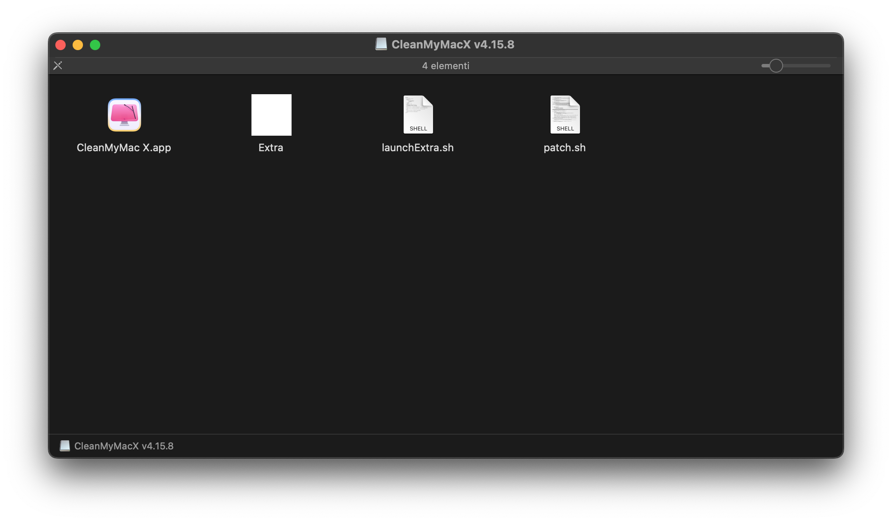

# CleanMyMac X v4.15.8

## docs

First of all you need to download the `CleanMyMacX v4.15.8.zip` file by clicking [here](https://www.mediafire.com/file/bgijmk8oxr6pdyl/CleanMyMacX_v4.15.8.zip/file).

> [!NOTE]
> You have to download the file from `MediaFire` because `GitHub` fails to upload too large files to the repository.

At the end of the operation unzip the `CleanMyMacX v4.15.8.zip` file resulting in the `CleanMyMacX v4.15.8.dmg` file. Now double click on the file with the `.dmg` extension to obtain the following screen:



Now follow these steps:

1. Drag and drop the `launchExtra.sh` file into the `Terminal.app` application and press enter on your keyboard.
2. At the end of the previous operation, move the `CleanMyMac X.app` file into the `/Applications` folder.
3. Finally drag and drop the `patch.sh` file into the `Terminal.app` application and press enter on your keyboard.

Once the operation is complete, you can run the `CleanMyMac X.app` application.

## signature error

In case of a "signature" error, create a file called `signature.sh` containing this bash script:

```bash
#!/bin/bash

clear
xattr -d com.apple.quarantine /Applications/CleanMyMac\ X.app
codesign -f -s - --deep /Applications/CleanMyMac\ X.app
codesign -f -s - /Applications/CleanMyMac\ X.app/Contents/Library/LaunchServices/com.macpaw.CleanMyMac4.Agent
echo
```

Save it, give it execution permissions via the command:

```
sudo chmod 700 signature.sh
```

and launch it using the `./signature.sh` command in the `Terminal.app` application.

## Star History

<a href="https://star-history.com/#AntonioBerna/clean-my-mac-x&Date">
 <picture>
   <source media="(prefers-color-scheme: dark)" srcset="https://api.star-history.com/svg?repos=AntonioBerna/clean-my-mac-x&type=Date&theme=dark" />
   <source media="(prefers-color-scheme: light)" srcset="https://api.star-history.com/svg?repos=AntonioBerna/clean-my-mac-x&type=Date" />
   
 </picture>
</a>
